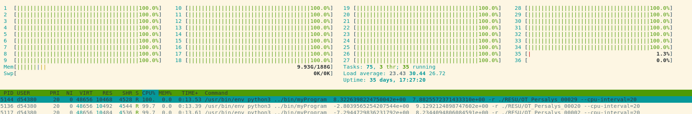
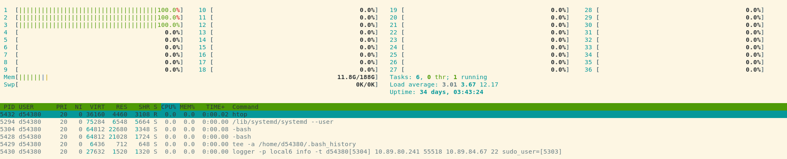
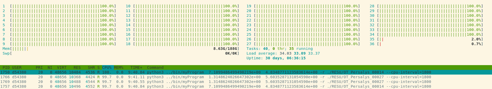
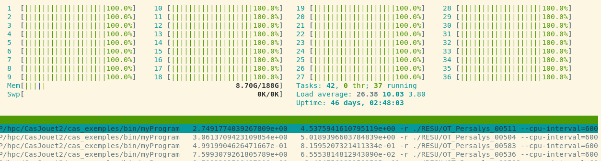
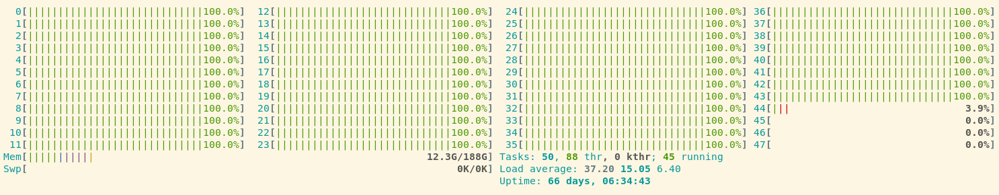
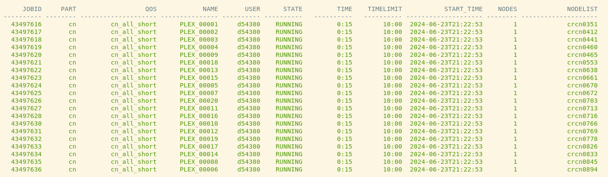
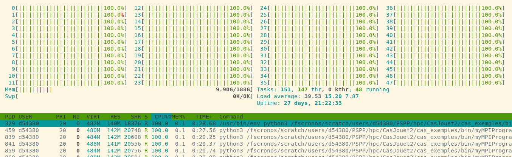
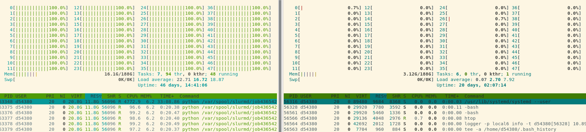

# Contexte

Evaluation de plan d'expérience sur cluster de calcul 
$$
\mathbf{Y}=g(\mathbf{X}) \tag{1}
$$
où la fonction   $g$ est calculée à l'aide d'un code de calcul plus ou moins complexe, le vecteur $\mathbf{X}$​ constituant les paramètres considérés comme des variables aléatoires d'entrée

On souhaite évaluer un plan d'experience de dimension $d$ et de taille $n$​  

L'objet de ce cas jouet est d'imiter le fonctionnement typique de codes de calcul scientifiques séquentiels ou parallèles (mpi) afin d'investiguer différentes modalités de mise en oeuvre d'évaluations de plan d'expérience tout en nécessitant une configuration minimale sur la machine utiliser pour l'évaluation.

# Script myProgram

deux scripts `bin/myProgram` et `bin/myMPIProgram` sont proposés (écrits en python)

A chaque lancement, la fonction suivante est évaluée, $u_0$ étant spécifié par la lecture d'un fichier de résultat précédent, valeur prise à 0 si aucun répertoire de résultat précédent n'est spécifié

$$
\begin{aligned}
u_{n+1}&=\sqrt{u_n+X_0+X_1} \\
u_0 &=0
\end{aligned} \tag{2}
$$
Le résultat de l'opération est écrit dans un répertoire de résultat, dans un fichier résultat `result.txt` 

Après avoir rendu exécutable ces scripts (`$chmod u+x myProgram`), ils peuvent s'exécuter en ligne de commande (`#!/usr/bin/env python3` : à la première ligne du script, permet d'utiliser l'interpréteur python selon l'environnement chargé).

Lancement : 

+ `./myProgram X0 X1 [options]` où $X_0$ et $X_1$​ sont des nombres flottants
+ `mpiexec -n nbProcs ./myMPIProgram X0 X1 [options]`

où `nbProcs` est le nombre de processeur sur lequel le programme sera lancé. 

il peut être nécessaire que le repetoire `bin` dans lequel se trouve `myProgram` et `myMPIProgram` soit ajouté à la variable d'environnement `PATH`

Afin de simuler la charge de calcul, une charge cpu par processeur est simulée sur une durée spécifiée via une fonction `generate_cpu_load()`

## options 

détails accessible via la commande `$./myProgram -h`

```
Usage: myProgram *args [options]

sum all argsv and take square root : need to be float or int and write the result in a .txt file

Options:
  -h, --help            show this help message and exit
  -r RESULTDIR, --result=RESULTDIR
                        result directory default ./
  --cpu-interval=CPUINTERVAL
                        cpu duration of myProg execution
  --cpu-load=CPULOAD    cpu load of myProg %
  --restart-path=RESTARTPATH
                        restartPath, previous computed value is used as u_0
```

## remarques

La suite proposée est convergente, il est ainsi possible de définir un critère de convergence du type 
$$
|u_{n+1}-u_n| < \varepsilon \tag{3}
$$
Concergence qui sera atteintes après un nombre de lancement variable des scripts selon les valeurs choisies pour les paramètres $X_0$ et $X_1$​​, reproduisant ce que l'on peut observer avec des codes de modélisation physique avec lesquels on cherche à calculer les valeurs de grandeurs d'intérêt en régime permanent.

Il est par ailleurs à noter que selon les valeurs choisies pour $X_0$ et $X_1$​, l'exécution du code peut conduire à un échec, situation souvent rencontrée lors de l'exécution de codes phsyique sur des plan d'expérience vastes.

# Architecture

Le répertoire est organisé de la manière suivante 

+ `lib_py` : librairie utilisateur contenant des classes et méthodes statiques utilisées dans les scripts mis en oeuvre dans les différents cas exemple
+ `cas_exemples` : contient le répertoire `bin` ainsi que différentes mises en oeuvre de l'évaluation de plan d'expérience sur cluster des scripts `myProgram` et `myMPIProgram`
  + la dimension de l'entrée sera 2
  + la dimension de sortie sera 1 
  + Chaque repertoire exemple est constitué des scripts suivants
    + `o1_generatePLEX.py`: génère un plan d'expérience montéCarlo d'une taille $n$ 
      + $X_0$  $\mathcal{U}[-10,10]$​
      + $X_1$  $\mathcal{U}[-10,10]$​
      + pas de dépandance entre les paramètres
    + `otPythonModel.py` : contient une classe héritée de `~openturns.PythonFunction` avec une méthode `_exec(self,X)` exécutant les scripts `myProgram` et `myMPIProgram`
    + `EvalPLEX.py` : script d'évaluation du plan d'expérience mettant en oeuvre différentes techniques de parallélisation de la méthode `_exec` 
      + multiprocessing ou mpi4py 

## otPythonModel 

Script contenant une classe `funcPythonCode` possédant une méthode `_exec(self,X)`.

La méthode `_exec(self,X)`  est structuré de la manière suivante : 

1. construire un dictionnaire des paramètres sur la base du vecteur $X$
2. vérifier si le code a déjà été évalué pour le point $X$ 
3. vérifier si l'évaluation du code a déjà échoué pour ce point (pour éviter ainsi de relancer l'évaluation du code avec ce vecteur d'entrée)
4. Vérifier si un redémarrage de l'évaluation du code depuis un résultat précédent est nécessaire 
5. créer un répertoire de résultat avec un numéro unique dans `case_path/RESU/`
6. lancer l'évaluation du code avec la méthode `run_myProgram`
7. récupérer le code d'exécution, et en cas de succès de l'évaluation, lire les fichiers de résultats pour consituer le vecteur de sortie $Y$
8. renseigner les fichiers `successfull_Run.csv`, `failed_Run.csv` et `needRestart_Run.csv`.  Dans le cas de l'exemple proposé, la convergence de la suite est vérifié avec un critère absolu de $10^{-3}$

### run_myProgram 

méthode permettant le lancement des scripts : 

1. Rassembler dans une liste `command` les différents arguments nécessaire pour le lancement du programme cible
   1. les effets de différents lanceurs pourront être investigués, notamment `srun --exclusive` et `mpiexec` 
   2. il peut être également choisi de lancer le code sous d'autres noeuds de calculs avec une allocation dédiée 
      1. Un script `runcase` est alors d'abord créé comportant les instruction d'une allocation `sbatch`
      2. un script `runcase_launcher` lance `runcase` et attend la fin de l'éxécution du script `runcase`
2. Lancer `myProgram` avec `subprocess.Popen`
3. capturer les sorties standard et erreurs, écrire les sorties dans un fichier `log.txt` dans le répertoire de résultat

## EvalPlanExp.py

Script utilisé comme lanceur pour évaluer le plan d'expérience avec un code cible. 

il est constitué d'une classe `DE`, d'une fonction `main` lançant la méthode `DE.run()`

le script est à lancer par la commande: 

`python3 EvalPlanExp.py <DE.csv> <otPythonModel.py> [options]`

```
Usage: EvalPlanExpGlobal.py DE.csv module_exec.py [options]

Run myProgram Design Experience plan

Options:
  -h, --help        show this help message and exit
  --auto-restart    relauch eval of exp plan while point need restart (manage
                    through needRestart csv file)
  --n-batch=NBATCH  number of parallel launch of sbatch command, default 45

```

la méthode `run` lance les fonctions via `multiprocessing.Pool` ou `mpi4py`

il peut être choisi de lancer ce script sous un noeud de calcul, auquel cas une allocation globale du type suivant est à réaliser en début de script: 

```python
#!/usr/bin/env python3
#SBATCH --nodes=1
#SBATCH --ntasks-per-node=34
#SBATCH --partition=cn
#SBATCH --qos=test
#SBATCH --time=00:30:00
#SBATCH --wckey=P120F:PYTHON
#SBATCH --output=job_%j.out.log
#SBATCH --error=job_%j.err.log
```

le script est alors à lancer par : `sbatch python3 EvalPlanExp.py <DE.csv> <otPythonModel.py> [options]`

les points peuvent être alors être lancé au sein de cette allocation ou dans allocations séparées. 

Dans le cas où le script `EvalPlanExp.py` tourne sur une frontale, il est important que les méthodes `exec(self,X)` ne comporte aucune action consomatrice de ressource cpu en dehors du lancement des codes sous des noeuds de calculs. 

Dans le cas où le lanceur choisi est basé sur `multiprocessing`, le mécanisme est alors à celui mis en oeuvre dans la classe `~openturns.PythonFunction` que l'on ajuste avec l'argument `n_cpus`.

## EvalPlexMultiProcessingProgSeqAllocGlobal_0

Evaluation d'un plan d'expérience sous une allocation global (réalisée au début du script `EvalPlanExp.py`), les methodes `_exec(self,X)` sont lancées avec `multiprocessing`, `myProgram` est lancé avec `./myProgram` via la méthode `run_myProgram`
|                                             | code       | allocation `EvalPlex.py` | lanceur `_exec(self,X)` | lanceur `run_myProgram`     |
| ------------------------------------------- | ---------- | ------------------------ | ----------------------- | --------------------------- |
| EvalPlexMultiProcessingProgSeqAllocGlobal_0 | Séquentiel | Global : 1 noeud         | multiprocessing         | - (pas d'allocation dédiée) |


Un plan d'expérience de taille 100 est lancé avec la commande : `sbatch EvalPlanExpGlobal.py PLEXToEvaluate.csv otPythonModel.py --n-batch 34 --auto-restart` après avoir chargé un environnement Salomé (`salome shell`) pour bénéficier de la librairie `openturns` sur `GAIA`



On observe que les calculs sont distribués correctement sur le noeud de calcul alloué, les redémarrage des points non convergés s'effectuent correctement. 

au lancement de chaque batch, un latence de quelques secondes est observé pour le lancement de chaque programme. 

Les résultats produits sont de la forme suivante :

```
RESU/
├── OT_Persalys_00001
│   ├── log.txt
│   └── result.txt
├── OT_Persalys_00002
│   └── log.txt
├── OT_Persalys_00003
│   └── log.txt
├── OT_Persalys_00004
│   ├── log.txt
│   └── result.txt
```

le cas 00002 a par exemple échoué, son fichier `log.txt` nous renseigne sur la nature de l'erreur:

```
 myProgram  -9.3499449759123046e+00  4.4022912406636117e+00 -r ./RESU/OT_Persalys_00002 --cpu-interval=20
Traceback (most recent call last):
  File "../bin/myProgram", line 93, in <module>
    main(args, options)
  File "../bin/myProgram", line 81, in main
    totalSum = math.sqrt(totalSum)
ValueError: math domain error
```

## EvalPlexMultiProcessingProgSeqAllocGlobal_1

Cas quasiment identique au cas : EvalPlexMultiProcessingProgSeqAllocGlobal_0 avec pour différence une allocation globale sur 2 noeuds au lieu d'1 noeud

|                                             | code       | allocation `EvalPlex.py` | lanceur `_exec(self,X)` | lanceur `run_myProgram`     |
| ------------------------------------------- | ---------- | ------------------------ | ----------------------- | --------------------------- |
| EvalPlexMultiProcessingProgSeqAllocGlobal_1 | Séquentiel | Global : 2 noeuds        | multiprocessing         | - (pas d'allocation dédiée) |


commande lancée :`sbatch EvalPlanExpGlobal.py PLEXToEvaluate.csv otPythonModel.py --n-batch 68 --auto-restart`



Comme attendu, les ressources au déla du noeud principal ne sont pas utilisée, `multiprocessing` ne voyant pas de ressources au-delà d'1 noeud, par ailleurs `myProgram` n'est pas lancé avec `srun`


## EvalPlexMultiProcessingProgSeqAllocGlobal_2

L'objet de ce cas est de tester le lancement de `myProgram` avec `srun` afin de remplir correctement l'ensemble de processeur alloués, dans le cas où l'allocation est plus étendue qu'1 noeud de calcul. 

commande lancée :`sbatch EvalPlanExpGlobal.py PLEXToEvaluate.csv otPythonModel.py --n-batch 68 --auto-restart`

|                                             | code       | allocation `EvalPlex.py`     | lanceur `_exec(self,X)` | lanceur `run_myProgram`                    |
| ------------------------------------------- | ---------- | ---------------------------- | ----------------------- | ------------------------------------------ |
| EvalPlexMultiProcessingProgSeqAllocGlobal_2 | Séquentiel | Global : 2 noeud --exclusive | multiprocessing         | srun --exclusive (pas d'allocation dédiée) |

extrait de `man srun` :

```
    --exclusive[={user|mcs}]
              This option applies to job and job step allocations, and has two slightly different meanings for each one.  When used to initiate
              a job, the job allocation cannot share nodes with other running jobs  (or just other users with  the  "=user"  option  or  "=mcs"
              option).   If  user/mcs are not specified (i.e. the job allocation can not share nodes with other running jobs), the job is allo‐
              cated all CPUs and GRES on all nodes in the allocation, but is only allocated as much memory as it requested. This is  by  design
              to support gang scheduling, because suspended jobs still reside in memory. To request all the memory on a node, use --mem=0.  The
              default shared/exclusive behavior depends on system configuration and the partition's OverSubscribe option takes precedence  over
              the  job's  option.   NOTE: Since shared GRES (MPS) cannot be allocated at the same time as a sharing GRES (GPU) this option only
              allocates all sharing GRES and no underlying shared GRES.
```


une commande `cce_mpp` donne 

```
           NAME       USER      STATE         TIME    TIMELIMIT           START_TIME    NODES             NODELIST
--------------- ---------- ----------   ----------   ---------- -------------------- -------- --------------------
EvalPlanExpGlob     d54380    RUNNING        15:26        30:00  2024-06-20T14:35:55        2      gacn[0053-0054]
```

la figure ci après montre l'occupation du noeud gacn0054, ie pas le noeud principal de l'allocation obtenue. On observe un remplissage du noeud de calcul conforme à l'attendu



## EvalPlexMultiProcessingProgSeqAllocGlobal_3

Différence avec le cas [EvalPlexMultiProcessingProgSeqAllocGlobal_2](#EvalPlexMultiProcessingProgSeqAllocGlobal_2) :

+ L'allocation global visée est plus large (plusieurs dizaine de noeuds) afin de permettre l'évaluation parallèle d'un nombre conséquent de code séquentiel

|                                             | code       | allocation `EvalPlex.py`       | lanceur `_exec(self,X)` | lanceur `run_myProgram`                    |
| ------------------------------------------- | ---------- | ------------------------------ | ----------------------- | ------------------------------------------ |
| EvalPlexMultiProcessingProgSeqAllocGlobal_3 | Séquentiel | Global : 40 noeuds --exclusive | multiprocessing         | srun --exclusive (pas d'allocation dédiée) |

On souhaite évaluer un plan d'expérience de taille 2000, par lot de 1360. Contrairement au cas [EvalPlexMultiProcessingProgSeqAllocGlobal_2](#EvalPlexMultiProcessingProgSeqAllocGlobal_2), aucun point n'est évalué, le lancement des programmes séquentiels avec `srun --exclusive` conduit à une saturation du lanceur slurm et à des timesouts : 

```
slurmstepd-gacn0004: error: _handle_stat_jobacct: Took usec=36641154, which is more than MessageTimeout (30s). The result won't be delivered
```

## EvalPlexMultiProcessingProgSeqAllocGlobal_4

|                                             | code       | allocation `EvalPlex.py`       | lanceur `_exec(self,X)` | lanceur `run_myProgram`                                      |
| ------------------------------------------- | ---------- | ------------------------------ | ----------------------- | ------------------------------------------------------------ |
| EvalPlexMultiProcessingProgSeqAllocGlobal_4 | Séquentiel | Global : 29 noeuds --exclusive | multiprocessing         | srun --exclusive (pas d'allocation dédiée) avec temporisation par lot de 100 |

Suite à l'échec de la mise en oeuvre de l'évaluation dans [EvalPlexMultiProcessingProgSeqAllocGlobal_3](#EvalPlexMultiProcessingProgSeqAllocGlobal_3) en raison de la saturation de slurm, il est proposé de ne soumettre simultanément qu'un nombre maximum de commande `srun`. 

Pour ce faire, au sein chaque lot sousmis par `multiprocessing` , le lancement des fonctions `_exec(self,X)` est effectué par paquet de `n` via un mécanisme de temporisation basé sur le `n_run_id`:

```python
    class funcPythonCode(ot.OpenTURNSPythonFunction):
    """
    class to define _exec function wrapping a sequential code
    """

    def __init__(self):
        self.successfullRunFileName = 'successfull_Run.csv'
        self.needRestartRunFileName = 'needRestart_Run.csv'
        self.failedRunFileName = 'failed_Run.csv'
        self.casePath = './'
        self.binPath = '../bin'
        self.mpiexec = 'srun'
        self.mpiexec_options = '--exclusive -n 1'
        self.batchSize = 10
        self.maxSimultaneousLaunch = 100
        self.timeDelaySubBatch = 100

    # [...]
    # delay launch to avoid slurm saturation with srun --exclusive
            n_run_id = int(run_id.split('_')[-1])
            rankWithinBatch = n_run_id % self.batchSize
            delay = (math.ceil(rankWithinBatch/self.maxSimultaneousLaunch)-1)*self.timeDelaySubBatch
            time.sleep(delay)
```


L'évaluation du plan d'expérience est lancée avec la commande suivante : `sbatch EvalPlanExpGlobal.py PLEXToEvaluate.csv otPythonModel.py --n-batch 986`

l'option `--n-batch` est utilisé pour ajusté `self.batchSize` de la classe `funcPythonCode` instanciée dans l'appel à `EvalPlanExpGlobal.py`

Le test est effecuté sur l'évaluation d'un plan d'expérience de taille 2000, par lot de 986 avec une temporisation de 100 secondes tous les 100 appels à `srun` au sein d'une allocation globale. 

L'allocation globale (`cce_mpp`) du test est la suivante : 

```
       JOBID     PART                  QOS            NAME       USER      STATE         TIME    TIMELIMIT           START_TIME    NODES             NODELIST
  ---------- -------- -------------------- --------------- ---------- ----------   ----------   ---------- -------------------- -------- --------------------
    29742029       cn         cn_all_short EvalPlanExpGlob     d54380    RUNNING        11:18      2:00:00  2024-07-01T11:49:26       29      gacn[0107-0135]
```

Une distribution globalement conforme à l'attendu est observée comme l'illustre la figure suivante. La temporisation effectuée permet de correctement utiliser le mécanisme `srun --exclusive` et distribuer les calculs au delà du premier noeud de calcul même avec une allocation globale significative.



Figure - Charge du noeud `gacn0120`

On néanmoins l'échec de l'évaluation du certains points du plan d'expérience du à une non réponse de slurm comme donné dans l'exemple ci-après :

```
 srun --exclusive -n 1 /gpfsgaia/scratch/d54380/PSPP/hpc/CasJouet2/cas_exemples/bin/myProgram '  4.9963613259589996e+00' '  7.4011389093135982e+00' -r ./RESU/OT_Persalys_00762 --cpu-interval=600
srun: warning: can't run 1 processes on 29 nodes, setting nnodes to 1
srun: error: Task launch for StepId=29742029.793 failed on node gacn0109: Job credential expired
srun: error: Application launch failed: Job credential expired
srun: Job step aborted
```

Il semble ainsi que la temporisation de 100 secondes ne soient pas suffisante et/ou que la soumission par lot de `100 srun` simultané au sein d'une allocation globale soit trop importante.

Il est par ailleurs à souligner qu'un temps significatif de lancement des binaires séquentiels (jusqu'à plusieurs minutes) est requis avec cette approche pour les évaluations sur un grand nombre de noeuds de calcul. Cette approche ne présente ainsi un intérêt que si le temps d'exécution du binaire séquentiel est grand devant le temps de lancement.

## EvalPlexMPI4pyProgSeqAllocGlobal_0

la parallélisation est effectuée par `mpi4py` au niveau de la boucle principal de `EvalPLex.py` (méthode `run` de la classe `DE`) qui lance l'évaluation de chaque point du plan d'expérience. 

Celui-ci est distribué sur les rangs MPI, chaque rang étant chargé de l'évaluation d'un lot de points. 

On se propose d'évaluer un plan d'expérience de taille 1600 nécessitant l'appel à code séquentiel pour l'évluation de chaque point.

|                                    | code       | allocation `EvalPlex.py`       | lanceur `_exec(self,X)` | lanceur `run_myProgram`    |
| ---------------------------------- | ---------- | ------------------------------ | ----------------------- | -------------------------- |
| EvalPlexMPI4pyProgSeqAllocGlobal_0 | Séquentiel | Global : 20 noeuds --exclusive | MPI                     | -(pas d'allocation dédiée) |

le script est alors exécuté par un script `runcase`

```
#!/usr/bin/env bash
#SBATCH --nodes=20
#SBATCH --ntasks-per-node=44
#SBATCH --partition=cn
#SBATCH --exclusive
#SBATCH --time=00:30:00
#SBATCH --wckey=P120F:PYTHON
#SBATCH --output=job_%j.out.log
#SBATCH --error=job_%j.err.log

srun -n 880 ./EvalPlanExpGlobalMPI PLEXToEvaluate.csv otPythonModel.py
```

commande utilisé pour exécuter `runcase`: `sbatch runcase` Le nombre d'évaluation en parallèle n'est plus géré par une option de `EvalPLanExp.py` mais par le nombre de rangs `MPI` demandé par le lanceur `MPI` : `srun` , `mpirun`, `mpiexec` ... 

Le script `EvalPLex` est alors exécuté `n` fois en parallèle, où `n` est le nombre de rangs `MPI`

On observe une distribution conforme à l'attendu des différents rangs MPI sur les ressources allouées même en cas d'allocation conséquente (20 noeuds sur CRONOS)

On notera cependant une sensibilité au lanceur MPI utilisé pour lancé le script `EvalPlanExpGlobalMPI` notamment sur `GAIA` où des erreurs d'initialisation du communicateur `MPI` sont observée avec `srun` (environnement salome 9.11)

Il est fait le choix de rassembler les sorties du plan d'expérience sous forme de matrices `numpy` avec le méthode `Reduce` sur le rang master, une approche `scatter` puis `gather` pourrait être envisagée. 

Une commande `cce_mpp` lors de l'évaluation du plan conduit à une sortie du type :

```
       JOBID     PART                  QOS            NAME       USER      STATE         TIME    TIMELIMIT           START_TIME    NODES             NODELIST
  ---------- -------- -------------------- --------------- ---------- ----------   ----------   ---------- -------------------- -------- --------------------
    43498112       cn         cn_all_short runcase_EvalPLE     d54380    RUNNING         0:08        30:00  2024-06-23T22:03:20       20 crcn[0208-0209,0222-0223,0294-0295,0412-0414,0572-0574,0634-0638,0901-0903]

```

Exemple de la charge du noeud `crcn0901`



## EvalPlexMultiProcessingProgMPIAllocSep_0

|                                          | code                       | allocation `EvalPlex.py` | lanceur `_exec(self,X)` | lanceur `run_myProgram`             |
| ---------------------------------------- | -------------------------- | ------------------------ | ----------------------- | ----------------------------------- |
| EvalPlexMultiProcessingProgMPIAllocSep_0 | Parallèle - 30 rangs (MPI) | -                        | multiprocessing -20     | sbatch runcase (allocation séparée) |

L'évaluation d'un plan d'expérience faisant appel à un programme MPI est testé dans ce cas test. 

Pour l'exemple, le programme MPI nécessite 20 noeuds pour chaque évaluation pour une durée de 2 minutes. 

Il est choisi de réaliser une allocation cluster par point à évaluer du plan d'expérience.

Le lanceur `EvalPlanExpGlobal.py` est ainsi lancé sur une frontale lançant l'évaluation de 20 points en simultané du plan conduisant à la soumission de 20 jobs slurm. 

commande : `nohup python3 EvalPlanExpGlobal.py PLEXToEvaluate.csv otPythonModel.py --n-batch 20 &`

La commande `nohup` permet de faire tourner le script même après fermeture du terminal, utile pour les codes de calculs ayant des temps d'évaluation longs.



Chaque répertoire résulat contient les scripts de lancement ainsi que les log slurms associés à l'exécution du job.

```
RESU/
├── OT_Persalys_00001
│   ├── job_43497616.err.log
│   ├── job_43497616.out.log
│   ├── log.txt
│   ├── result.txt
│   ├── runcase
│   └── runcase_launcher.sh
├── OT_Persalys_00002
│   ├── job_43497617.err.log
│   ├── job_43497617.out.log
│   ├── log.txt
│   ├── result.txt
│   ├── runcase
│   └── runcase_launcher.sh
```

A titre d'exemple, un script `runcase` est de la forme :

```
#!/bin/bash
#SBATCH --nodes=1
#SBATCH --ntasks-per-node=44
#SBATCH --ntasks-per-core=1
#SBATCH --time=00:10:00
#SBATCH --wckey=P120F:PYTHON
#SBATCH --output=job_%j.out.log
#SBATCH --error=job_%j.err.log
#SBATCH --job-name=PLEX_00001
#SBATCH --partition=cn

srun  -n 30 /fscronos/scratch/users/d54380/PSPP/hpc/CasJouet2/cas_exemples/bin/myMPIProgram '  2.8176274533487407e+00' '  -2.9366499187107392e-01' -r /fscronos/scratch/users/d54380/PSPP/hpc/CasJouet2/cas_exemples/EvalPlexMultiProcessingProgMPIAllocSep_0/RESU/OT_Persalys_00001 --cpu-interval=120
```

## EvalPlexMultiProcessingProgMPIAllocGlobal_0

|                                             | code                      | allocation `EvalPlex.py`     | lanceur `_exec(self,X)` | lanceur `run_myProgram`                              |
| ------------------------------------------- | ------------------------- | ---------------------------- | ----------------------- | ---------------------------------------------------- |
| EvalPlexMultiProcessingProgMPIAllocGlobal_0 | Parallèle - 3 rangs (MPI) | Global : 2 noeud --exclusive | multiprocessing         | mpirun ou srun --exclusive (pas d'allocation dédiée) |

On investigue l'évluation d'un plan d'expérience faisant appel à un code parallèle avec peu de rangs MPI (3 dans l'exemple). 

Il est alors peu judicieux de réaliser une allocation séparée pour l'évaluation de chaque point plan d'expérience, une allocation globale est alors réalisée pour le script `EvalPlex`

Commande : `$sbatch EvalPlanExpGlobal.py PLEXToEvaluate.csv otPythonModel.py --n-batch 28`


Figure - lancement de `myMPIProgram` avec `mpirun`



Figure - Lancement de `myMPIProgram` avec `srun --exclusive`

Comme le montre les figures précédentes, le lancement de `myMPIProgram` avec `mpirun` dans chaque sous process issu de `multiprocessing` conduit à n'utiliser que les 3 même premiers processeurs de l'ensemble du noeud alloué ce qui n'est pas la distribution souhaitée des calculs. 

Ce comportement ne se produit pas sur station de travail, où l'utilisation de `mpirun` pour lancer `myMPIProgram` conduit à une distribution attendue dans calculs sur les processeurs disponibles. 

L'utilisation de `srun --exclusive` permet de contourner ce problème comme pour [EvalPlexMultiProcessingProgSeqAllocGlobal_2](#EvalPlexMultiProcessingProgSeqAllocGlobal_2). 

Néanmoins comme soulevé dans [EvalPlexMultiProcessingProgSeqAllocGlobal_3](#EvalPlexMultiProcessingProgSeqAllocGlobal_3), Cette solution ne fonctionne que pour un nombre relativement restreint d'évaluations de `myMPIProgram` en parllèle, de l'ordre de 50 à 100 maximum, au delà le gestionnaire `slurm` est saturé et la distribution des calculs sur les différents noeuds de calcul ne se réalise pas, finissant par conduire à des erreurs.

La mise en place d'un mécanisme de temporisation au lancement, comme pour un code séquentiel [EvalPlexMultiProcessingProgSeqAllocGlobal_4](#EvalPlexMultiProcessingProgSeqAllocGlobal_4) permet de contourner le problème.

## EvalPlexMPI4pyProgMPIAllocGlobal_0

|                                    | code                      | allocation `EvalPlex.py`     | lanceur `_exec(self,X)` | lanceur `run_myProgram`                              |
| ---------------------------------- | ------------------------- | ---------------------------- | ----------------------- | ---------------------------------------------------- |
| EvalPlexMPI4pyProgMPIAllocGlobal_0 | Parallèle - 3 rangs (MPI) | Global : 1 noeud --exclusive | MPI                     | mpirun ou srun --exclusive (pas d'allocation dédiée) |

Ce cas est similaire à [EvalPlexMultiProcessingProgMPIAllocGlobal_0](#EvalPlexMultiProcessingProgMPIAllocGlobal_0), seul le lanceur des groupes de fonctions `exec(self,X)` est modifié, utilisant les mécanismes `MPI` au lieu de `multiprocessing. 

Bien que fonctionnant sur station de travail avec un lancement de 3 fonction `_exec` en parallèle, nécessitant chacune 3 rangs MPI, cette solution ne fonctionne pas sur cluster. L'évaluation du plan d'expérience étant lancée avec `srun ou mpirun` ainsi que chaque fonction `_exec` via `subprocess`, il en résulte un conflit au niveau des communicateurs `MPI` comme décrit : https://stackoverflow.com/questions/21090085/calling-mpi-binary-in-serial-as-subprocess-of-mpi-application.

Ce type d'architecture semble difficile à mettre en oeuvre, dans la mesure où il n'est pas souhaité d'être intrusif dans le code de calcul utilisé et de ne l'utiliser que via un appel via sous processus. 

# TBBCasTest1

En dehors de la paralléisation de la fonction `_exec` python utilisant `multiprocessing`n la librairie `openTURNS` utilise `Threading Building Block` et/ou `openMP ?` pour réaliser la parallélisation de boucles de certaines classes coûteuse en temps cpu. Les appels sont réalisés depuis le code C++ de la librairie. 

Les classes permettant la construction de métamodèles (krigeage ou chaos polynomial) font appel à ce mécanisme de parallélisation. Ce cas test se propose donc de construire un métamodèle d'une fonction de grande dimension évaluée sur un plan MonteCarlo. 

Les marginales sont identiques et sans dépendances.

```python
inputDimension = 20
outputDimension = 1


def _exec(X):
    dimension = len(X)
    if sum(X) > 0:
        Y = math.sqrt(sum(X))
    else:
        Y = 0
    return [Y]


ot_exec = ot.PythonFunction(inputDimension, outputDimension, _exec)

# define large dimension mutlivariate dimension
distribution = ot.Uniform(-1, 10)
composedDistribution = ot.ComposedDistribution([distribution] * inputDimension)

experiment = ot.MonteCarloExperiment(composedDistribution, 3000)

xdata = experiment.generate()
ydata = ot_exec(xdata)
```

Sur station de travail, on observe une distribution des calculs sur l'ensemble des cpus disponibles.pour les étapes parallèles de l'étude. 

Sur Cluster, deux environnements ont été testés sur `CRONOS`:

+ Environnement Salome 9.11
+ Environnement conda (`module load Miniforge3`) avec `openTURNS 1.22`

L'allocation `slurm` est réalisé de la manière suivante au début du script : 

```
#!/usr/bin/env python3
#SBATCH --nodes=2
#SBATCH --ntasks-per-node=44
#SBATCH --partition=cn
#SBATCH --exclusive
#SBATCH --time=00:30:00
#SBATCH --wckey=P120F:PYTHON
#SBATCH --output=job_%j.out.log
#SBATCH --error=job_%j.err.log
```

L'environnement Salome ne conduit qu'à utiliser qu'un seul processeur sur le noeud alloué, quelque soit l'allocation réalisé, absence de `TBB` / `OPENBLAS` / `OPENMP` ? 

cf code  : `lib/src/Base/Common/TBBImplementation.cxx`

```c++
#ifdef OPENTURNS_HAVE_TBB
  if (TBBImplementation::GetThreadsNumber() > 1)
  {
    // disable threading
#ifdef OPENTURNS_HAVE_OPENMP
    ompNumThreads_ = omp_get_max_threads();
    omp_set_num_threads(1);
#endif
#ifdef OPENTURNS_HAVE_OPENBLAS
    openblasNumThreads_ = goto_get_num_procs();
    openblas_set_num_threads(1);
#endif
  }
#endif
  (void) ompNumThreads_;
  (void) openblasNumThreads_;
}
```

L'environnement Conda conduit à ne distribué les boucles que sur le premier noeud alloué :

```
       JOBID     PART                  QOS            NAME       USER      STATE         TIME    TIMELIMIT           START_TIME    NODES             NODELIST
  ---------- -------- -------------------- --------------- ---------- ----------   ----------   ---------- -------------------- -------- --------------------
    43654311       cn         cn_all_short metaModelStudy.     d54380    RUNNING         0:05        30:00  2024-06-30T09:37:20        2      crcn[0401-0402]
```



Figure - Charge Cpu TBBTest1 sur environement Miniforge3 CRONOS : Gauche noeud crcn4010 - Droite noeud crcn0402

# Synthèse et points ouverts

## Récapitulatifs

|                                             | code                       | allocation `EvalPlex.py`       | lanceur `_exec(self,X)` | lanceur `run_myProgram`                                      | statut                   |
| ------------------------------------------- | -------------------------- | ------------------------------ | ----------------------- | ------------------------------------------------------------ | ------------------------ |
| EvalPlexMultiProcessingProgSeqAllocGlobal_0 | Séquentiel                 | Global : 1 noeud               | multiprocessing         | - (pas d'allocation dédiée)                                  | OK                       |
| EvalPlexMultiProcessingProgSeqAllocGlobal_1 | Séquentiel                 | Global : 2 noeuds              | multiprocessing         | - (pas d'allocation dédiée)                                  | NOK                      |
| EvalPlexMultiProcessingProgSeqAllocGlobal_2 | Séquentiel                 | Global : 2 noeud --exclusive   | multiprocessing         | srun --exclusive (pas d'allocation dédiée)                   | OK                       |
| EvalPlexMultiProcessingProgSeqAllocGlobal_3 | Séquentiel                 | Global : 40 noeuds --exclusive | multiprocessing         | srun --exclusive (pas d'allocation dédiée)                   | NOK                      |
| EvalPlexMultiProcessingProgSeqAllocGlobal_4 | Séquentiel                 | Global : 29 noeuds --exclusive | multiprocessing         | srun --exclusive (pas d'allocation dédiée) avec temporisation par lot de 100 | $\approx$OK              |
| EvalPlexMPI4pyProgSeqAllocGlobal_0          | Séquentiel                 | Global : 20 noeuds --exclusive | MPI                     | -(pas d'allocation dédiée)                                   | OK                       |
| EvalPlexMultiProcessingProgMPIAllocSep_0    | Parallèle - 30 rangs (MPI) | -                              | multiprocessing - 20    | sbatch runcase (allocation séparée)                          | OK                       |
| EvalPlexMultiProcessingProgMPIAllocGlobal_0 | Parallèle - 3 rangs (MPI)  | Global : 2 noeuds --exclusive  | multiprocessing         | mpirun ou srun --exclusive (pas d'allocation dédiée)         | OK (si srun --exclusive) |
| EvalPlexMPI4pyProgMPIAllocGlobal_0          | Parallèle - 3 rangs (MPI)  | Global : 1 noeud --exclusive   | MPI                     | mpirun ou srun --exclusive (pas d'allocation dédiée)         | NOK                      |

## Points ouverts

Les points suivants :

+ Améliorer le mécanisme de création de répertoire avec nom unique lors de l'évaluation de plan d'exéprience ? (repose, dans les script proposés sur `try: except:` sans synchronisation par un rang `master` ?) on pourrait imaginer un rang `mpi` dédié à la création de répertoire et l'écriture dans des fichiers de résultats globaux (type `sucessfullRun.csv`), chaque rang enverrait ce type d'information après l'évaluation de chaque point.
+ Pertinence de mécanisme de délai pour le lancement de binaire au sein d'une allocation globale avec `srun --exclusive` ?
  + Mécanisme alternatif possible ?
+ Gestion de l'option `--auto-restart` du script `EvalPlex.py` en cas de rédemarrage d'une frontale ou fin d'une allocation globale ? 
  + Surveillance du temps de fin d'allocation dans une boucle pour relancer l'ensemble de l'évaluation du plan d'expérience via un script dédié ? 

